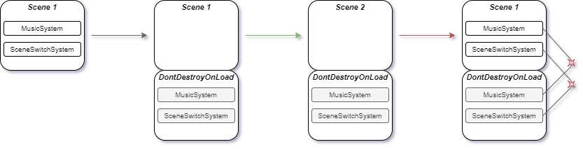
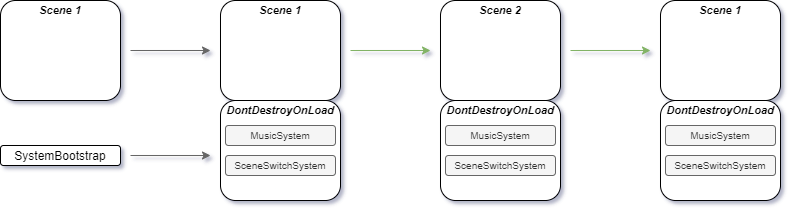

## System Bootstrapping

This package is heavily influenced by a [blog](https://medium.com/medialesson/simple-service-locator-for-your-unity-project-40e317aad307) on service locators by Dino Fejzagić

------------------------
A small package for facilitating an easy and scalable singleton boot approach.

-------------------------

Singletons in Unity make a lot of things very easy. They also have some annoying features related to the Unity Livecycle of objects and randomization of destruction of objects,
causing null reference exeptions among other things. One of the more annoying parts to me is the part where your singletons are part of a scene and returning to this scene
causes the destruction of the duplicate singletons in this scene that are now conflicting with the singletons set to not be destroyed on load.

This conflict in combination with the fact that code in Awake can and will still run when an object is destroyed immediately after its creation, can cause a lot of problems with
events, coroutines and other interaction of your singletons with other scripts.

To circumvent this problem you would want your singletons to be created only once during the start of your game. Luckily there is an attribute that makes this possible.
This attribute called [RuntimeInitializeOnLoadMethod](https://docs.unity3d.com/ScriptReference/RuntimeInitializeOnLoadMethodAttribute.html) gives you the option of 
executing a function once after or before loading the first scene.

To visualize the problem and how the bootstrapper fixes it:

### Without Bootstrap (placing them in the scene)

### With Bootstrap

----------------------------
The SystemBootstrap uses the RuntimeInitializeOnLoadMethod attribute to create the system locator before the first scene is loaded. After creating the system locator
it can register pretty much any Custom made System that you want. The only 3 requirements are:

- The system derives from the SystemBehaviour abstract class
- The system is placed as a component on a gameobject that is a prefab.
- The prefab the system is placed on is inside a Resources/Systems folder. 

The SystemLocator can now load the prefab systems from the resources folder and place them in this first scene loaded.
Retrieval of the System instance can be done using the SystemLocator's Get function e.g. "SystemLocator.Instance.Get<MusicSystem>()".

### Features

- Bootstrapping of Systems when loading the first scene in the game for the first time
- A demo scene with examples of a scene switch system and music system.

### Download

You can download the UnityPackage here: https://drive.google.com/file/d/1a93uAdqCn6p3NyZAgPBYXRCyF6Q2O1qs/view?usp=sharing 
